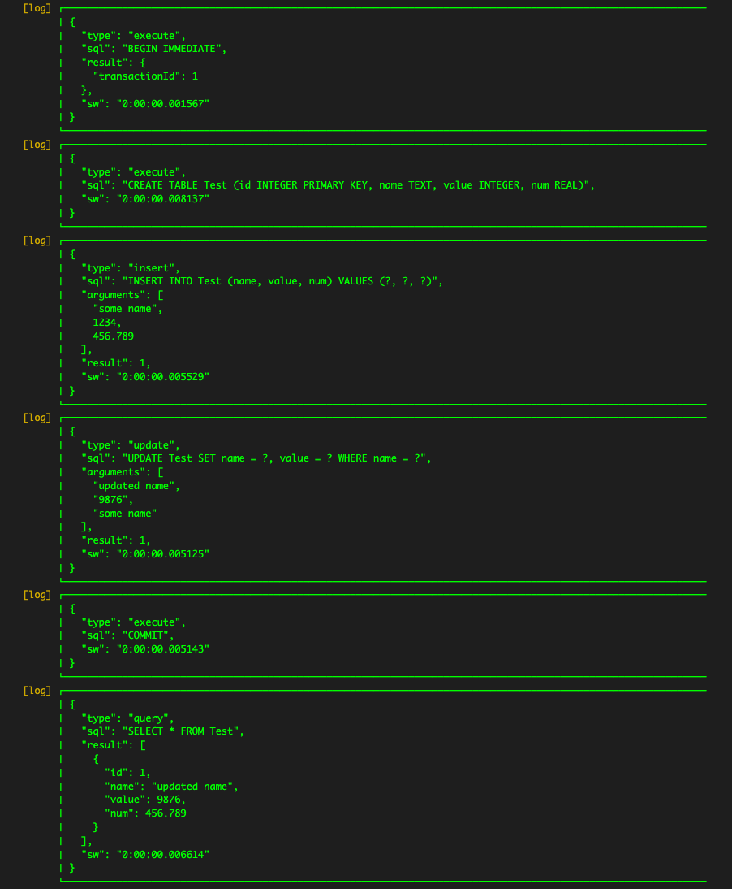

# Talker Sqflite Logger

[![style: lint][lint_badge]][lint_link]
[![License: MIT][license_badge]][license_link]

sqflite library logger on talker base.

## Installation 💻

**❗ In order to start using Talker Sqflite Logger you must have the [Flutter SDK][flutter_install_link] installed on your machine.**

Install via `flutter pub add`:

```sh
flutter pub add talker_sqflite_logger
```

---

## How to use 🚀

To log your operations, you need to create the database using a factory:

```dart
import 'package:talker_sqflite_logger/talker_sqflite_logger.dart';

final factory = TalkerSqfliteDatabaseFactory(
  talker: Talker(),
  settings: const TalkerSqfliteLoggerSettings(),
);

_db = await factory.openDatabase(
  path: await _path,
  options: OpenDatabaseOptions(),
);
```

From now you can log the database operation:

```dart
final factory = TalkerSqfliteDatabaseFactory(
  talker: Talker(),
  settings: const TalkerSqfliteLoggerSettings(
    printSqlEvents: false,
    printDatabaseOpenEvents: true,
    printOpenDatabaseOptions: true,
    printDatabaseCloseEvents: true,
    printDatabaseDeleteEvents: true,
  ),
);

_db = await factory.openDatabase(
  path: _path,
  options: OpenDatabaseOptions(
    version: 1,
    onCreate: (db, version) {
      db.execute(
        'CREATE TABLE Test (id INTEGER PRIMARY KEY, name TEXT, value INTEGER, num REAL)',
      );
    },
  ),
);

await _db.close();
await deleteDatabase(await _path);
```


Or log your SQL queries, including the transactions:

```dart
final factory = TalkerSqfliteDatabaseFactory(
  talker: Talker(),
  settings: const TalkerSqfliteLoggerSettings(
    printSqlResults: true,
  ),
);

_db = await factory.openDatabase(
  path: await _path,
);

await _db.transaction((txn) async {
  txn.execute(
    'CREATE TABLE Test (id INTEGER PRIMARY KEY, name TEXT, value INTEGER, num REAL)',
  );
  txn.insert(
    'Test',
    {
      'name': 'some name',
      'value': 1234,
      'num': 456.789,
    },
  );
  txn.update(
    'Test',
    {
      'name': 'updated name',
      'value': '9876',
    },
    where: 'name = ?',
    whereArgs: [
      'some name',
    ],
  );
});

_db.query('Test');
```



You also can log the batch operations:

```dart
final factory = TalkerSqfliteDatabaseFactory(
  talker: Talker(),
  settings: const TalkerSqfliteLoggerSettings(
    printSqlEvents: false,
  ),
);

_db = await factory.openDatabase(
  path: await _path,
);

final batch = _db.batch();

batch.execute(
  'CREATE TABLE Test (id INTEGER PRIMARY KEY, name TEXT, value INTEGER, num REAL)',
);
await batch.rawInsert(
  'INSERT INTO Test(name, value, num) VALUES("some name", 1234, 456.789)',
);
await batch.rawUpdate(
  'UPDATE Test SET name = ?, value = ? WHERE name = ?',
  ['updated name', '9876', 'some name'],
);

await batch.commit();
```


It is possible to filter the queries only to log a specific table or operation:

```dart
final factory = TalkerSqfliteDatabaseFactory(
  talker: Talker(),
  settings: TalkerSqfliteLoggerSettings(
    sqlEventFilter: (event) => event.sql.contains('UPDATE'),
  ),
);

_db = await factory.openDatabase(
  path: await _path,
);

await _db.execute(
  'CREATE TABLE Test (id INTEGER PRIMARY KEY, name TEXT, value INTEGER, num REAL)',
);
await _db.rawInsert(
  'INSERT INTO Test(name, value, num) VALUES("some name", 1234, 456.789)',
);
await _db.query('Test');
await _db.rawUpdate(
  'UPDATE Test SET name = ?, value = ? WHERE name = ?',
  ['updated name', '9876', 'some name'],
);
await _db.rawQuery('SELECT * FROM Test');
```


It works with batches as well:

```dart
final factory = TalkerSqfliteDatabaseFactory(
  talker: Talker(),
  settings: TalkerSqfliteLoggerSettings(
    printSqlEvents: false,
    sqlBatchEventFilter: (operations) => operations
      .map(
        (operation) => operation.sql.contains('INSERT INTO'),
      )
      .toList(),
  ),
);

_db = await factory.openDatabase(
  path: await _path,
);

final batch = _db.batch();

batch.execute(
  'CREATE TABLE Test (id INTEGER PRIMARY KEY, name TEXT, value INTEGER, num REAL)',
);
await batch.rawInsert(
  'INSERT INTO Test(name, value, num) VALUES("some name", 1234, 456.789)',
);
await batch.rawUpdate(
  'UPDATE Test SET name = ?, value = ? WHERE name = ?',
  ['updated name', '9876', 'some name'],
);

await batch.commit();
```


But, if you prefer logging the calls to the platform plugins, you can achieve it by passing the parameter SqfliteDatabaseFactoryLoggerType into openDatabase method:

```dart
final factory = TalkerSqfliteDatabaseFactory(
  talker: Talker(),
  settings: const TalkerSqfliteLoggerSettings(
    printSqlResults: true,
  ),
);

_db = await factory.openDatabase(
  path: await _path,
  type: SqfliteDatabaseFactoryLoggerType.invoke,
);

await _db.transaction((txn) async {
  txn.execute(
    'CREATE TABLE Test (id INTEGER PRIMARY KEY, name TEXT, value INTEGER, num REAL)',
  );
  txn.insert(
    'Test',
    {
      'name': 'some name',
      'value': 1234,
      'num': 456.789,
    },
  );
  txn.update(
    'Test',
    {
      'name': 'updated name',
      'value': '9876',
    },
    where: 'name = ?',
    whereArgs: [
      'some name',
    ],
  );
});

_db.query('Test');
```


## Running Tests 🧪

To run all unit tests:

```sh
flutter test --coverage
```

To view the generated coverage report you can use [lcov](https://github.com/linux-test-project/lcov).

```sh
# Generate Coverage Report
genhtml coverage/lcov.info -o coverage/

# Open Coverage Report
open coverage/index.html
```

[flutter_install_link]: https://docs.flutter.dev/get-started/install
[lint_badge]: https://img.shields.io/badge/style-lint-4BC0F5.svg
[lint_link]: https://pub.dev/packages/lint
[license_badge]: https://img.shields.io/badge/License-BSD_3--Clause-blue.svg
[license_link]: https://opensource.org/licenses/BSD-3-Clause
